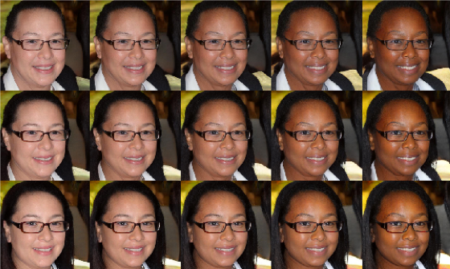

<!--

    

        

        
        

        

            <b>Matched sample selection for face datasets via GAN projection. </b>  
            C. Singh, G. Balakrishnan, P. Perona  
            In submission. Link coming soon.  
        

    

-->

    

        

        
        

        

            <b>Towards causal benchmarking of bias in face analysis algorithms. </b>  
            G. Balakrishnan, Y. Xiong, W. Xia, P. Perona.  
            ECCV 2020  
            <a href="https://arxiv.org/abs/2007.06570"> paper </a>
        

    

___

<!--
To increase the size of the title, use fewer # in front of the paper title.
To decrease the size of the title, use more #. 
To remove the italics, remove the * before and after the description
To remove the underline from the title, remove the <u> tags (<u> and </u>)
-->
